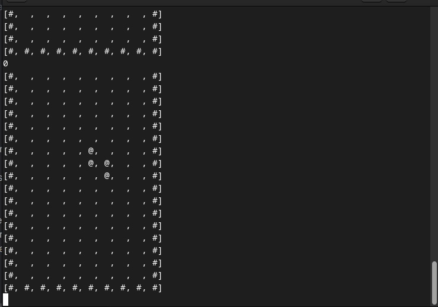
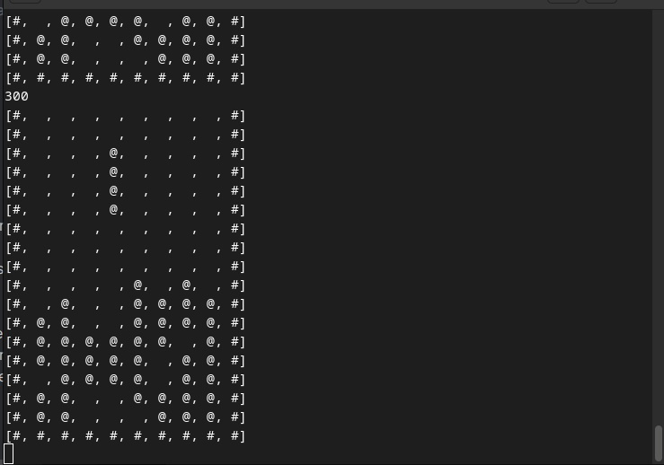

# Tetris

## Description
This project is a simplified version of the classic Tetris game. It operates in the terminal, where figures are displayed and the game logic is executed.

## Requirements
- **Java 17**: Required for running and building the project.
- **Maven**: Used for dependency management and project building.

## Commands for Running and Building
### Building the Project
mvn clean package

text
This command cleans the `target` directory and builds the project.

### Running the Project
mvn exec:java

text
This command launches the game in the terminal. Note that when you start the project, the org-example-Main file opens. It is needed for the program to accept input values from the keyboard.

## In-Game Controls
- **Move Left**: Use the `A` key.
- **Move Right**: Use the `D` key.
- **Rotate Counter-Clockwise**: Use the `Q` key.
- **Rotate Clockwise**: Use the `E` key.
- **Drop Down Quickly**: Use the `S` key.

## Images

